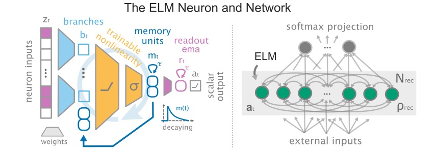

# Scaling Laws and Tradeoffs in Recurrent Networks of Expressive Neurons

This repository provides an implementation of the ELM Network in Jax with Equinox, including minimal training scripts and experiment launch orchestration code.

> This repository extends the ELM Network with the input-wiring conditions and event-camera datasets used in [*The Computational Value of Sensory-Aligned Receptive Fields Depends on Neuronal Expressivity*](https://arxiv.org/abs/2609.26940) (see [Input Wiring extensions](#input-wiring-extensions)).



## Launching Experiments

***Prior to launching an experiment you need to:***

1) download the dataset e.g. Enwik8 (see below)
2) install the conda environment e.g. `elmnetwork_env.yml` (see below)
3) define your setup (paths, envs, wandb etc.) in e.g. `configs/setup/local_default.yaml`
4) define or modify your experiments e.g. `experiments/number_vs_complexity_of_neuron_enwik8.yaml`

make sure your experiment definition uses the correct default configs from `./configs` e.g. your setup yaml.

***Launching one of the provided / modified experiments:***

From the package root folder, run in the terminal:

```
conda activate elmnetwork_env
python src/training/local_launch_script.py -cn=number_vs_complexity_of_neuron_enwik8
```

for a Slurm cluster with Nvidia GPUs use `elmnetwork_env_gpu` with `launch_script`.

***Quick debug run, analysis, modifications:***

- if you want to overwrite existing model / training parameters simply modify the python call (e.g. for debug_run):
    - ``` python src/training/local_launch_script.py -cn=number_vs_complexity_of_neuron_enwik8 setup.debug_run=True```
- if you use wandb you may easily retrieve the results of a sweep check out `analysis/experiment_plotting.ipynb` as an example.
- if you want to write custom training code you may take a look at `src/training/training_script_enwik8.py` as a start.

## Repository Overview

***The core model and training code is in:***
```
src/
├── datasets/
├── models/
└── training/
```
- the ELM Neuron and Network implementations are in `src/models`
- the dataset specific dataloaders, loss functions and plotting functions are in `src/datasets`
- the training scripts and local and cluster launch scripts are in `src/training`

***The experiment and sweep configurations are in:***
```
configs/
experiments/
```

- the specific default model, training or setup `.yaml` configs are here
- you MUST adjust `configs/setup` to your environment to launch experiments
- full experiment definitions including multi-seed and parameters sweeps are here

***Some experiment and model analysis code is in:***
```
analysis/
```
- example trained model, and notebook to load model and run inference
- additional notebook to retrieve experiments from wandb (some provided) and simple plotting
- // potentially power-law fitting related analysis code will be added later

## Input Wiring extensions

Additions in this repository, on top of the upstream ELM Network:

- `src/models/elm_wiring.py` -- input wiring conditions (structured, spatial,
  direction-selective, fully connected), selected per experiment with
  `layer_config.input_wiring`
- `src/datasets/dvs_gesture/`, `src/datasets/cifar10_dvs/` -- event-camera
  dataloaders reading preprocessed npz frames, with optional
  direction-selective channels and a fixed input permutation
- `src/training/training_script_dvs.py` -- training script for both event
  datasets
- `src/training/reg_schedule.py` -- ramps a regularizer strength over training
- `configs/`, `experiments/` -- model, training and experiment configurations
  for the reported conditions

Two upstream files carry additive edits: `ELMLayer` gains weight accessors for the weight-based regularizers, and the SHD dataloader gains an optional input permutation. Both default to the previous behaviour.

## Environment Setup

For running experiments on an Nvidia GPU cluster please use the CUDA version:

```
conda env create -f elmnetwork_env_gpu.yml
```

if solving is slow or the environment seems conflicted make sure to enable:

```
conda config --set solver libmamba
conda config --set channel_priority flexible
```

For instructions on how to install miniconda please refer to: [installation guide](https://www.anaconda.com/docs/getting-started/miniconda/install/overview)

## Dataset Setup

The training scripts expect the following data structure overall

```
<DATASETS BASE FOLDER>/
├── language_modeling/
│   └── enwik8/
├── heidelberg/
└── neuronio/
    ├── train/
    └── test/
        └── Data_test/
```

you only need to download the specific dataset you want to run experiments on.

***Preparing the Enwik8 Dataset:***

You can simply run the following commands to download the dataset (~1.3GB):

```
mkdir -p <DATASETS BASE FOLDER>/language_modeling/enwik8
cd <DATASETS BASE FOLDER>/language_modeling/enwik8
wget --continue http://mattmahoney.net/dc/enwik8.zip
wget https://raw.githubusercontent.com/salesforce/awd-lstm-lm/master/data/enwik8/prep_enwik8.py
python3 prep_enwik8.py
```

If you wish to download a whole suite of language datasets run:

```
bash src/datasets/language/getdata.sh
```

***Preparing the SHD and SHD-Adding Dataset:***

You may download the dataset using the provided utils (~0.5GB):

```
from src.datasets.shd.shd_download_utils import get_shd_dataset
get_shd_dataset(<DATASETS BASE FOLDER>, "heidelberg")
```

Dataloaders for both datasets are provided.
More details can be found at the website: [spiking-heidelberg-datasets-shd](https://zenkelab.org/resources/spiking-heidelberg-datasets-shd/)

***Preparing the NeuronIO Dataset:***

Running NeuronIO experiments (very optional) requires first downloading the dataset from Kaggle (~115GB).

- Train Data (train): [single-neurons-as-deep-nets-nmda-train-data](https://www.kaggle.com/datasets/selfishgene/single-neurons-as-deep-nets-nmda-train-data)
- Test Data (test/Data_test): [single-neurons-as-deep-nets-nmda-test-data](https://www.kaggle.com/datasets/selfishgene/single-neurons-as-deep-nets-nmda-test-data)

More details can be found in the following repository: [neuron_as_deep_net](https://github.com/SelfishGene/neuron_as_deep_net)

## Citation

> If you use the input-wiring conditions, please cite:
>
> ```
> @article{adorante2026receptive,
>   title={The Computational Value of Sensory-Aligned Receptive Fields Depends on Neuronal Expressivity},
>   author={Adorante, Agnese and Spieler, Aaron and Levina, Anna},
>   journal={arXiv preprint arXiv:2609.26940},
>   year={2026},
> }
> ```
> 
> For the ELM Network itself, please cite:
>
> ```
> @article{spieler2026scaling,
>   title={Scaling Laws and Tradeoffs in Recurrent Networks of Expressive Neurons},
>   author={Spieler, Aaron and Martius, Georg and Levina, Anna},
>   journal={arXiv preprint arXiv:2605.12049},
>   year={2026}
> }
> ```


